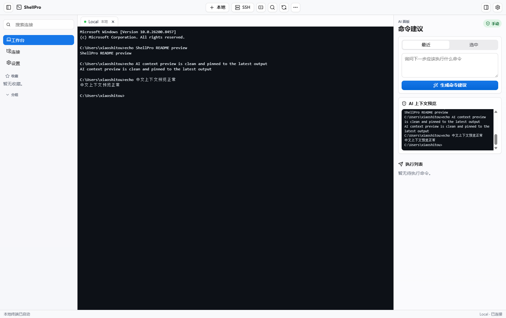

# ShellPro

ShellPro is a cross-platform terminal, SSH profile manager, and safe AI command
advisor. It is built with Tauri 2, Rust, React, TypeScript, and xterm.js.

## Preview



## Current MVP

- Apple-inspired desktop workspace with sidebar, toolbar, terminal area, and AI inspector.
- Local PTY terminal sessions through Rust and `portable-pty`.
- SSH sessions launched through the system `ssh` command with profile settings.
- SQLite-backed SSH profile storage.
- System keychain-backed secret storage for AI keys and profile secrets.
- DeepSeek-backed AI command suggestion flow with context redaction, local risk classification, and manual-only execution.
- Browser preview fallback for UI QA outside the Tauri runtime.

## Safety Model

AI suggestions never execute automatically. Suggested commands enter the execution
list first, and the user must manually send each command to the terminal. High
risk commands require explicit confirmation.

## Development

```bash
npm install
npm run tauri dev
```

Useful checks:

```bash
npm run build
cargo test --manifest-path src-tauri/Cargo.toml
npm run check
```

## Notes

The default AI provider is DeepSeek at `https://api.deepseek.com` using the
`deepseek-v4-flash` model. API keys are stored in the system keychain and are
never written to the project files.
